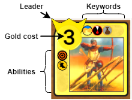

# Relics

Relics is an augumented chess game where pieces have more varied behaviours than the traditional chess ones.

### Key differences to traditional chess:
* Players can have arbitrary number of Kings and the game is over when one of the players loses _all_ of their Kings.
* The board is 7x7.
* There is the possibility Pass instead of making a move.
* In addition to the traditional Capture and Move actions pieces can also Support, Dispatch and Corrupt.
* Pieces consume Gold to Move, Capture, Support, etc.

### Flow of the Game
* The Game is made up of Rounds
  * At round start both players gain a new Gold coin slot (max. 8), then get their slots filled.
  * The player who starts the round alternates throughout the Game.
  * The round ends when both players Passed consecutively.
* Rounds are made up of Turns
  * A Turn ends after the Player acts in any way, be it a Pass or a Move.
  * Turns alternate between players until the end of the Round.

### Unit graphics explanation

