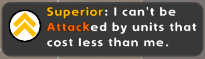
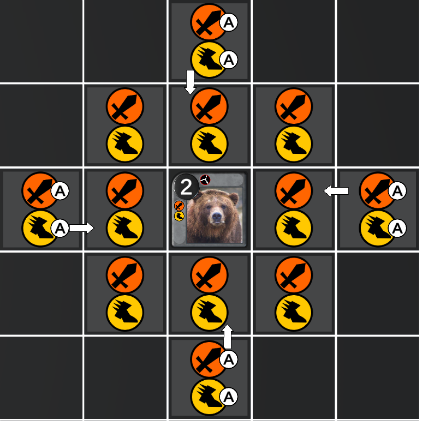
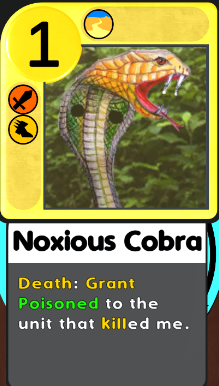

# Introduction

Relics is an augumented chess game where pieces have more varied behaviours than the pieces in traditional. The game has both PvP and PvE modes, but the game is designed to be the best when playing with someone else. There is also an loadout constructor function to create your own army.

## Key differences to traditional chess:
* Players can have arbitrary number of Kings and the game is over when one of the players loses _all_ of their Kings.
* The board is 7x7.
* There is the possibility Pass instead of making a move.
* In addition to the traditional Capture and Move actions pieces can also Support, Dispatch and Corrupt.
* Pieces consume Gold to Move, Capture, Support, etc.

# Rules

## Flow of the Game
* The Game is made up of Rounds
  * At round start both players gain a new Gold coin slot (max. 8), then get their slots filled.
  * The player who starts the round alternates throughout the Game.
  * The round ends when both players Passed consecutively.
* Rounds are made up of Turns
  * A Turn ends after the Player acts in any way, be it a Pass or a Move.
  * Turns alternate between players until the end of the Round.

## Pieces
The most important attributes of pieces can be seen at any point in the game. This is how the compact verion of a piece looks like on the board:

### Keywords
Keywords are general effects that can theoretically be granted to or removed from any unit at any point in the game. For example:

### Abilities
Abilities are unique to each Piece. They can be viewed in the Ability View window by tapping/clicking on the unit in game. It looks like this:

**Abilities (3 general types):**
* **Offensive (Unit -> Enemy)** 
  * Attack
    * Melee: The unit moves to the field after attacking it (like traditional chess)
    * Ranged: The units stays in place 
  * Corrupt: The effect is unique to the specific Piece (applying some debuff to an enemy) 
* **Neutral (Unit -> Empty Field)**
  * Move: Unit moves to targeted field (like traditional chess)
  * Dispatch: The effect is unique to the specific Piece
* **Support (Unit -> Ally):** The effect is unique to the specific Piece (applying some buff to an ally)

For instance a traditional chess piece would have Melee and Move.

Pieces can have multiple abilities, but they cannot have multiple ones of the same general type (Offensive, Neutral and Support).

### Unique behaviours
In addition to the preset Ability types and Keywords Pieces can also have some unique effects. This makes it possible to have some truly unique characters in the game. If a Piece has a unique effect it's show immediately on the Expanded Piece View upon hovering the desired unit. It looks like this:

These effects can be triggered by the event desribed in the text. In the example above it's triggered by the Piece dying.

# Controls

When it's your turn you can perform an action on any unit that is eligible do something (you have enough Gold for example). To perform the action hover the unit and see the available moves it can make (attacks, moves, supports, ...). If you don't want to or can't do anything with the units Pass by pressing the large Pass button on the right.

Quickly tap or click a unit to see a detalied view of their ability.

# Download
1. Download **build.zip** [here](https://github.com/ddkatona/relics/releases/tag/relics_v1.0)
2. Extract **build.zip**
3. Run **Relics.exe**
